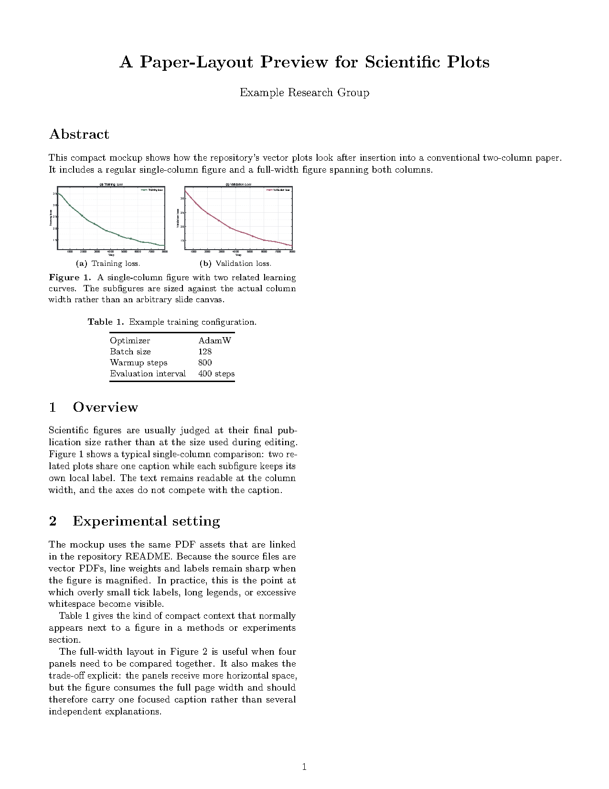
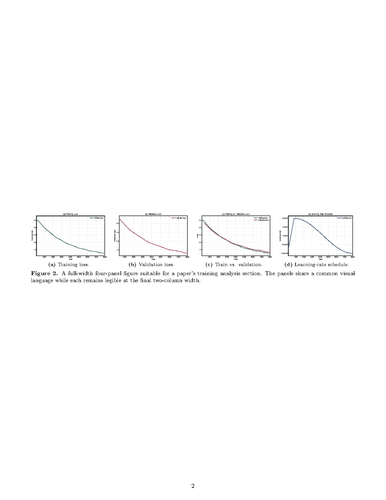

# My Codex Skills

<p align="center">
  <a href="README.md"><strong>English</strong></a>
  ·
  <a href="README.zh-CN.md"><strong>中文</strong></a>
</p>

This repository contains my custom Codex skills for creating polished, configurable scientific plots and reading English research papers.

## Skills

### `plot-training-curves`

Create configurable line plots for LLM and machine-learning training logs, including:

- Training loss
- Validation loss
- Training vs. validation loss
- Learning-rate schedule

The skill emphasizes reusable plotting code with explicit config interfaces for figure size, colors, line styles, alpha, markers, titles, labels, legends, ticks, grids, and export settings.
Its default plots use a complete `2.5 pt` axes frame, `2.0 pt` main curves, and slightly stronger marker edges.

### `plot-bar-charts`

Create configurable single and grouped bar charts for scientific comparisons, including:

- Single bar charts
- Highlighted-method bar charts
- Grouped bar charts
- Error bars and value labels

The skill also requires generated bar-plot code to expose config controls for bar width, colors, alpha, edge style, error bars, value labels, legend placement, axis settings, and export formats.
Its default plots use a complete `2.5 pt` axes frame and `2.0 pt` bar outlines.

### `paper-reading`

Read an attached English research paper and produce an evidence-grounded Chinese explanation for a reader who knows basic machine learning but not the paper's domain. The skill covers:

- STAR summary of the motivation, task, method, and results;
- exact method reconstruction with equations, symbols, data flow, training, and inference;
- independent experiment tables for setup, results, and ablations;
- separation of observations, hypotheses, algorithmic consequences, and experimental support;
- limitations, inconsistencies, uncertainty, and the boundary of the conclusions.

It requires important claims and numbers to be tied to paper locations when available, and distinguishes direct evidence, author speculation, reasonable inference, and unreported information.

The complete analysis is saved as a Markdown file (`.md`), with `$...$` for inline math and `$$...$$` for display math.

## Examples

Each preview links to the corresponding PDF file.

The preview values are illustrative synthetic data. Regenerate all previews with `python3 assets/examples/generate_examples.py` in an environment with `matplotlib` and `numpy`.

### Training Curves

<table>
  <tr>
    <td align="center" width="50%">
      <a href="assets/examples/sample_llm_training_curves_a_train_loss.pdf">
        
      </a>
      <br>
      <strong>(a) Training loss</strong>
    </td>
    <td align="center" width="50%">
      <a href="assets/examples/sample_llm_training_curves_b_val_loss.pdf">
        
      </a>
      <br>
      <strong>(b) Validation loss</strong>
    </td>
  </tr>
  <tr>
    <td align="center" width="50%">
      <a href="assets/examples/sample_llm_training_curves_c_train_vs_val_loss.pdf">
        
      </a>
      <br>
      <strong>(c) Training vs. validation loss</strong>
    </td>
    <td align="center" width="50%">
      <a href="assets/examples/sample_llm_training_curves_d_lr_schedule.pdf">
        
      </a>
      <br>
      <strong>(d) Learning-rate schedule</strong>
    </td>
  </tr>
</table>

### Bar Charts

<table>
  <tr>
    <td align="center" width="50%">
      <a href="assets/examples/sample_bar_single.pdf">
        
      </a>
      <br>
      <strong>Single highlighted bar chart</strong>
    </td>
    <td align="center" width="50%">
      <a href="assets/examples/sample_bar_grouped.pdf">
        
      </a>
      <br>
      <strong>Grouped bar chart</strong>
    </td>
  </tr>
</table>

### Paper-layout mockup

The repository also includes a two-page paper-layout preview that embeds the
same vector PDFs in a realistic two-column manuscript. It demonstrates a
single-column two-panel figure, a full-width four-panel `figure*`, subfigure
labels, captions, body-text references, and the final-size relationship between
plots and surrounding content.

<p align="center">
  <a href="assets/examples/paper_layout/paper_layout_demo.pdf">
    
  </a>
  <a href="assets/examples/paper_layout/paper_layout_demo.pdf">
    
  </a>
</p>

The source is [`assets/examples/paper_layout/paper_layout_demo.tex`](assets/examples/paper_layout/paper_layout_demo.tex). From that directory, rerun it with:

```bash
latexmk -pdf paper_layout_demo.tex
```

## Installation

Install all three skills with Codex's GitHub skill installer:

```bash
python3 "${CODEX_HOME:-$HOME/.codex}/skills/.system/skill-installer/scripts/install-skill-from-github.py" \
  --repo 0917Ray/my-codex-skills \
  --path skills/plot-training-curves skills/plot-bar-charts skills/paper-reading
```

To install only the paper-reading skill, use `--path skills/paper-reading` in the same command.

Or manually copy the skill folders to your Codex skills directory:

```bash
mkdir -p ~/.codex/skills
cp -R skills/plot-training-curves ~/.codex/skills/
cp -R skills/plot-bar-charts ~/.codex/skills/
cp -R skills/paper-reading ~/.codex/skills/
```

Restart Codex after installation.

Example request: “请用 $paper-reading 阅读附件论文，按 STAR 结构解释方法，并核查实验是否支持结论。”

## Repository Layout

```text
my-codex-skills/
├── skills/
│   ├── plot-training-curves/
│   ├── plot-bar-charts/
│   └── paper-reading/
└── assets/
    └── examples/
        └── paper_layout/
            └── paper_layout_demo.tex
```

## Notes

The bundled plotting scripts require a Python environment with `matplotlib` and `numpy`. The paper-reading skill does not include a script.

These skills are intended both as runnable tools and as plotting-code templates. When Codex writes new plotting code using these skills, it should expose a clear config interface rather than hard-coding visual parameters.
