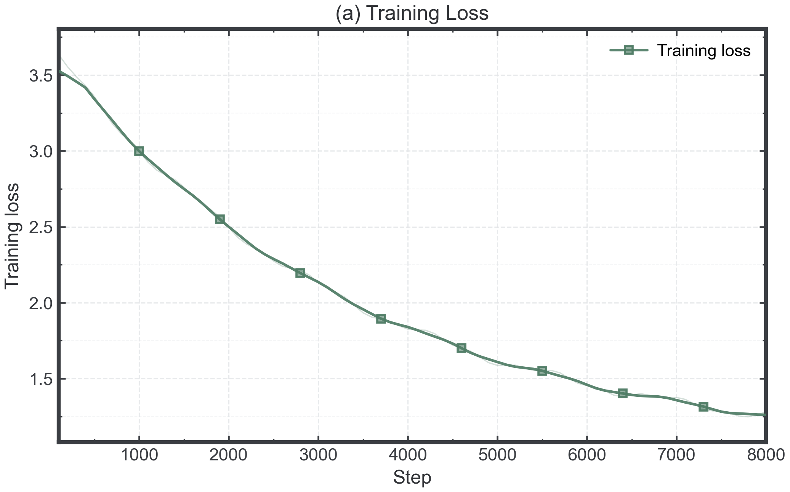
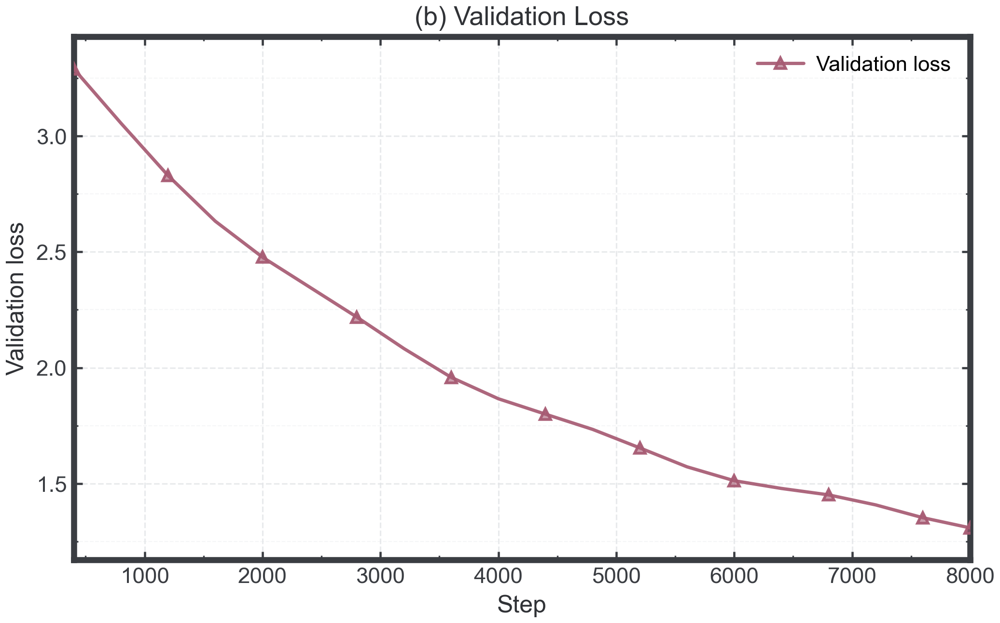
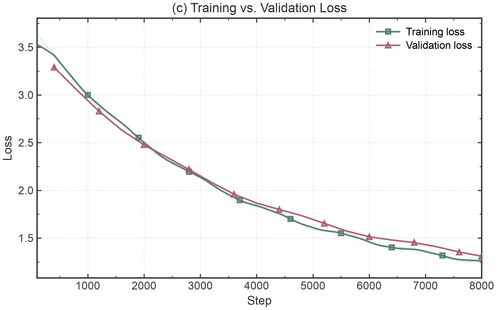
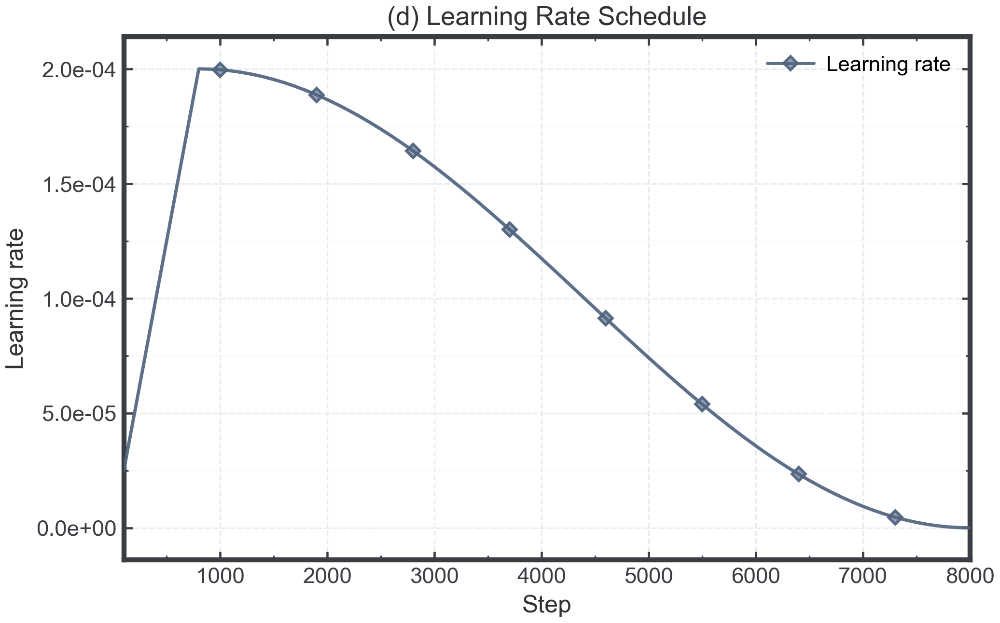
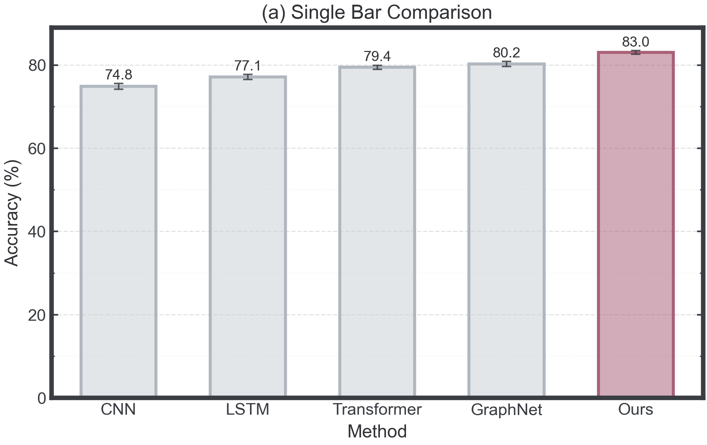
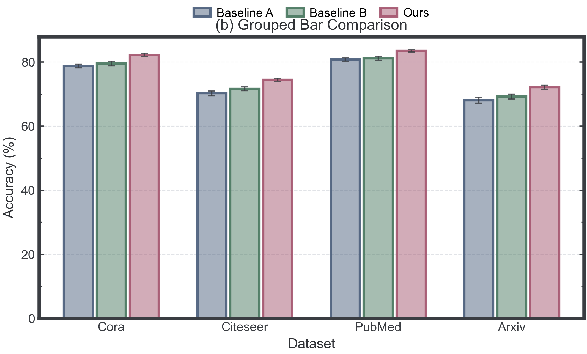

# 我的 Codex Skills

<p align="center">
  <a href="README.md"><strong>English</strong></a>
  ·
  <a href="README.zh-CN.md"><strong>中文</strong></a>
</p>

本仓库包含我的自定义 Codex skills，用于绘制风格统一、可配置、适合科研展示的图表。

## Skills 列表

### `plot-training-curves`

用于绘制 LLM / 机器学习训练日志曲线，包括：

- 训练损失
- 验证损失
- 训练损失与验证损失对比
- 学习率调度

该 skill 强调可复用绘图代码，要求显式预留 config 接口，用于控制图尺寸、颜色、线型、透明度、marker、标题、坐标轴标签、图例、刻度、网格和导出参数。

### `plot-bar-charts`

用于绘制科研对比类柱状图，包括：

- 单组柱状图
- 突出某个方法的柱状图
- 分组柱状图
- 误差条与数值标签

该 skill 同样要求生成的柱状图代码预留 config 控制项，包括柱宽、颜色、透明度、边框、误差条、数值标签、图例位置、坐标轴设置和导出格式。

## 效果示例

每张预览图都可以点击打开对应的 PDF 文件。

### 训练曲线

<table>
  <tr>
    <td align="center" width="50%">
      <a href="assets/examples/sample_llm_training_curves_a_train_loss.pdf">
        
      </a>
      <br>
      <strong>(a) 训练损失</strong>
    </td>
    <td align="center" width="50%">
      <a href="assets/examples/sample_llm_training_curves_b_val_loss.pdf">
        
      </a>
      <br>
      <strong>(b) 验证损失</strong>
    </td>
  </tr>
  <tr>
    <td align="center" width="50%">
      <a href="assets/examples/sample_llm_training_curves_c_train_vs_val_loss.pdf">
        
      </a>
      <br>
      <strong>(c) 训练损失与验证损失对比</strong>
    </td>
    <td align="center" width="50%">
      <a href="assets/examples/sample_llm_training_curves_d_lr_schedule.pdf">
        
      </a>
      <br>
      <strong>(d) 学习率调度</strong>
    </td>
  </tr>
</table>

### 柱状图

<table>
  <tr>
    <td align="center" width="50%">
      <a href="assets/examples/sample_bar_single.pdf">
        
      </a>
      <br>
      <strong>单组高亮柱状图</strong>
    </td>
    <td align="center" width="50%">
      <a href="assets/examples/sample_bar_grouped.pdf">
        
      </a>
      <br>
      <strong>分组柱状图</strong>
    </td>
  </tr>
</table>

## 安装

可以使用 Codex 的 GitHub skill installer 安装：

```bash
python install-skill-from-github.py \
  --repo 0917Ray/my-codex-skills \
  --path skills/plot-training-curves skills/plot-bar-charts
```

也可以手动复制 skill 文件夹到 Codex 的 skills 目录：

```bash
mkdir -p ~/.codex/skills
cp -R skills/plot-training-curves ~/.codex/skills/
cp -R skills/plot-bar-charts ~/.codex/skills/
```

安装后需要重启 Codex 才能识别新 skills。

## 仓库结构

```text
my-codex-skills/
├── skills/
│   ├── plot-training-curves/
│   └── plot-bar-charts/
└── assets/
    └── examples/
```

## 说明

脚本需要 Python 环境中安装 `matplotlib` 和 `numpy`。

这些 skills 既可以作为可运行工具，也可以作为绘图代码模板。Codex 使用这些 skills 编写新绘图代码时，应提供清晰的 config 接口，而不是把视觉参数硬编码在绘图语句中。
